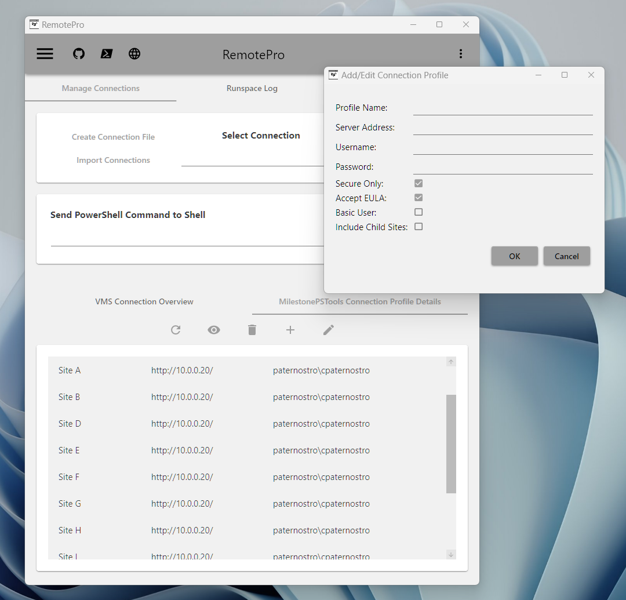
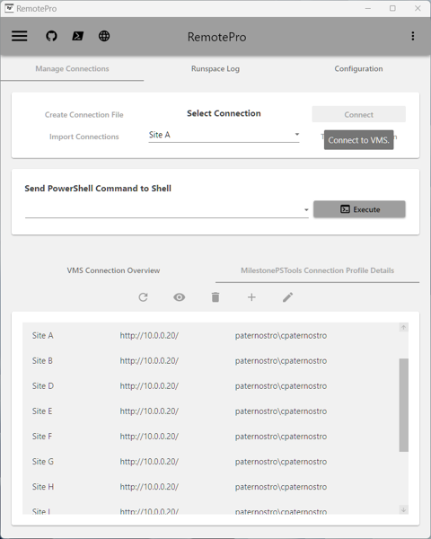

# Configuration Guide

This guide will help you configure RemotePro. Follow the steps below to set up your environment.

## Prerequisites

Before you begin, ensure you have the following:

- RemotePro module installed
- Access to XProtect Management Server

## Step 1: Setting Up RemotePro

1. Open Windows PowerShell terminal by searching for **PowerShell** in the Start menu and selecting **Windows PowerShell** :material-powershell:.
2. If the RemotePro module is not installed, use the command below.

    ``` powershell
    Install-Module -Name RemotePro
    ```

3. Open the WPF (Window Presentation Framework) main window with the following cmdlet.

    ``` powershell
    Start-RpRemotePro
    ```

## Step 2: Preparing Connection to XProtect Management Server

1. Under the hood of the main window [MilestonePSTools](https://www.milestonepstools.com/) is available and offers [connection profiles](https://www.milestonepstools.com/blog/2023/09/29/introducing-connection-profiles-and-custom-attributes/#what-is-a-connection-profile) to manage and store connection information to management servers.

2. If you do not have connection profiles configured, you can import them using an excel sheet. Click **Create Connection File**, open the excel file, and enter site information and save the file. You can then click **Import Connections** to navigate to and select the default file created. This will connect to each site in the excel file and create a connection profile. *Alternatively* you can use the *MilestonePSTools Connection Profiles Details* tab and click the :material-plus: icon to add a site's management server.

{ align=center }

## Step 3: Connecting Using Connection Profile

1. Select your site in the drop down menu and click **Connect** button
{ align=center }

2. You are now connected to your management server and can interact with XProtect using RemotePro's GUI!

## Conclusion

You have successfully configured your RemotePro. More usage guides and examples are in progress!
